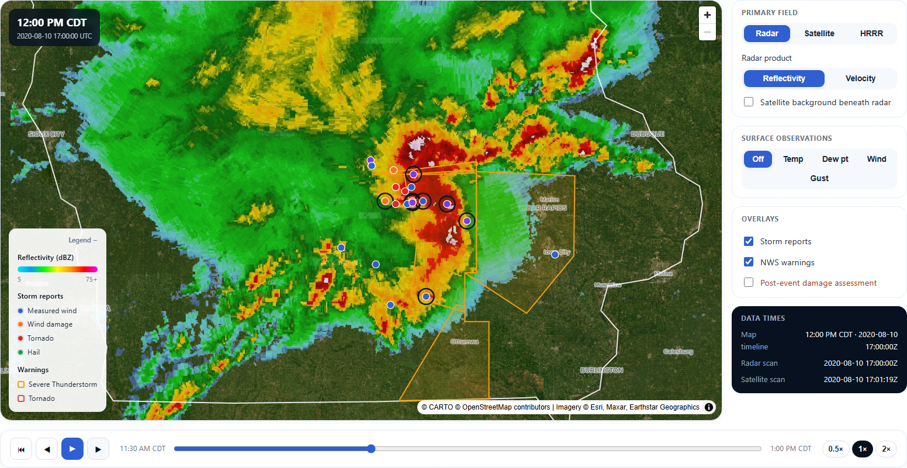

# Dylan McDermott — Portfolio & Engineering Examples

Meteorologist and geospatial data professional. This repository contains:

1. **[Iowa Severe Weather Data Explorer](weather-geospatial/examples/iowa-severe-weather-explorer/)** —
   the flagship project: an interactive replay of the August 10, 2020 Iowa
   derecho, built on real archived data end to end.
2. **The portfolio website** — a multi-page React + TypeScript site (this
   root), deployed to GitHub Pages.
3. **[`weather-geospatial/`](weather-geospatial/)** — reproducible, tested
   example workflows that turn authoritative weather data into validated maps,
   analyses, and products.

---

## Iowa Severe Weather Data Explorer

**Live demo:** https://dylanmcd16.github.io/projects/iowa-severe-weather-explorer/



A five-minute-frame replay of the derecho's central- and eastern-Iowa crossing,
combining seven independently-sourced datasets on one synchronized timeline —
each layer keeps its own true valid/scan time rather than pretending everything
was observed at once:

| Layer | Source |
|---|---|
| Radar reflectivity | IEM archived national NEXRAD base-reflectivity composite (N0Q) |
| Radar velocity | Single-site NEXRAD Level II (KDMX) via the Google Cloud public mirror, parsed with `metpy` |
| Storm reports | IEM Local Storm Report (LSR) archive |
| NWS warnings | IEM storm-based warning polygons (VTEC/SBW) |
| Surface observations | IEM ASOS/AWOS, nearest-observation-per-frame matching + full event time series |
| Model fields | NOAA HRRR archive (AWS), byte-range GRIB2, fixed 12Z cycle, 6 variables |
| Satellite | GOES-16 ABI Cloud & Moisture Imagery (AWS) — visible / infrared / sandwich |
| Post-event damage | Real NWS Damage Assessment Toolkit (DAT) points, tracks, and polygons |

A separate before/after slider compares real Sentinel-2 imagery of Greenfield,
Iowa across the May 21, 2024 tornado.

### Architecture

The browser never parses raw scientific formats. An offline Python pipeline
(`weather-geospatial/examples/iowa-severe-weather-explorer/`) downloads from
public archives, reprojects/crops everything onto one Iowa-bounding-box grid,
and writes static web assets — transparent WebP rasters plus GeoJSON — along
with a manifest and timeline that the React app loads and filters by time in
the browser. The frontend is a dedicated Vite multi-page entry
(`/projects/iowa-severe-weather-explorer/`), kept separate from the portfolio
SPA so the MapLibre bundle never loads on the homepage.

### Run the frontend

```powershell
npm install
npm run dev
```

Open the local address Vite prints, then navigate to
`/projects/iowa-severe-weather-explorer/`.

### Run the Python pipeline

```powershell
cd weather-geospatial/examples/iowa-severe-weather-explorer
pip install -r requirements.txt
python run_pipeline.py                     # everything, for the configured event window
python run_pipeline.py --only radar hrrr   # recompute a subset; other sources are
                                            # carried forward from the existing timeline.json
```

Event window, domain, and per-source parameters live in
`config/derecho-2020.yml`. See that example's own
[README](weather-geospatial/examples/iowa-severe-weather-explorer/README.md)
for the full source-by-source breakdown and design rules (honest timing, no
false precision, contemporaneous vs. post-event labeling).

---

## Portfolio website

A multi-page React and TypeScript portfolio deployed to GitHub Pages at
`https://dylanmcd16.github.io/` (site root, no subpath).

### Run locally

```powershell
npm install
npm run dev
```

Open the local address shown by Vite, usually `http://localhost:5173`.

### Test

```powershell
npm test          # Vitest unit tests
npm run test:e2e  # Playwright smoke tests (builds/serves dist/ automatically)
```

Both run in CI before every deployment
(`.github/workflows/deploy.yml`).

### Customize the content

Most visible text for the main portfolio page is stored in one file:

```text
src/data/portfolio.ts
```

Edit that file to change your biography, links, projects, experience,
research, and skills. The main layout is in `src/App.tsx`; the visual design
is in `src/index.css`.

### Add your résumé

Place your PDF here:

```text
public/resume.pdf
```

The Résumé link will then work automatically.

### Production check

```powershell
npm run build
npm run preview
```

The production files are generated in `dist/`. Do not commit `dist`; GitHub
Actions builds it automatically on every push to `main`.

---

## `weather-geospatial/`

Reproducible, tested example workflows that turn authoritative weather data
into validated maps, analyses, and products, following an
**acquire → validate → normalize → analyze → publish** pipeline. Each workflow
runs offline against small sample data **and** against live authoritative
sources (NWS/IEM, SPC, NOAA MRMS/HRRR/GOES on S3, NCEI) via a `--live` flag —
no API keys required.

| Workflow | Demonstrates |
|----------|--------------|
| [Surface observations](weather-geospatial/examples/01-surface-observations/) | ingestion, unit normalization, physical-range QC, geodesic nearest-station |
| [Severe-weather report ETL](weather-geospatial/examples/02-severe-weather-reports/) | schema validation, event normalization, duplicate reconciliation, point-in-polygon joins |
| [MRMS radar raster analysis](weather-geospatial/examples/03-mrms-radar-analysis/) | raster metadata, clip/reproject, Cloud Optimized GeoTIFF, zonal statistics |
| [Report → station matching](weather-geospatial/examples/04-report-station-matching/) | spatial + temporal joins, geodesic nearest-neighbor, evidence output |
| [GPS field-sensor processing](weather-geospatial/examples/05-gps-field-sensor/) | GPS QC, inward-buffer edge filtering in equal-area CRS, plot aggregation |
| [Multi-source event package](weather-geospatial/examples/06-multi-source-event/) | orchestration, partial-failure handling, multi-source provenance, packaging |
| [HRRR model processing](weather-geospatial/examples/07-hrrr-model-processing/) | xarray NWP fields, derived variables, grid sampling, model-vs-obs residuals |
| [GOES-GLM aggregation](weather-geospatial/examples/08-goes-glm-aggregation/) | object-storage discovery, defensive download logic, point-to-grid density |
| [Climate anomaly mapping](weather-geospatial/examples/09-climate-anomaly/) | baseline normals, departure-from-normal, multi-year series, gap handling |
| [Iowa Severe Weather Data Explorer](weather-geospatial/examples/iowa-severe-weather-explorer/) | the full pipeline described above |

See the [`weather-geospatial/` README](weather-geospatial/README.md) for the
full package, tests, and planned additions.
