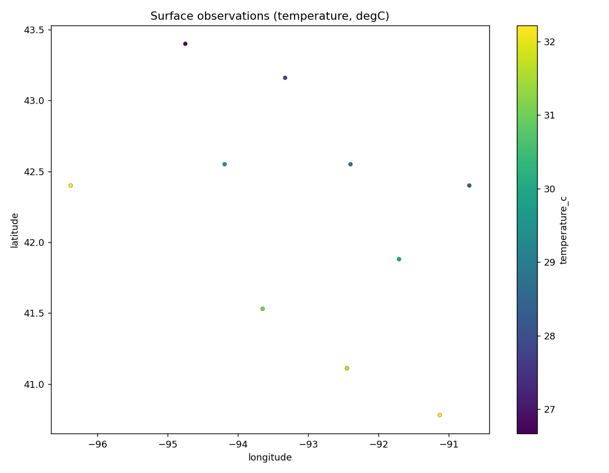

# 01 · Surface-observation acquisition & quality control

Ingest METAR-style surface observations, quality-control them, and find the
nearest valid station to a target location.

**Pipeline:** `acquire → validate → normalize → analyze → publish`

```
CSV / REST obs
    │  validate  (required columns, timestamps, coordinates, physical ranges)
    ▼
normalize   (°F→°C, kt→m/s, in→mm; standardized column names)
    │
    ▼
clean       (drop unusable rows, null impossible values — recorded in provenance)
    │
    ▼
analyze     (geodesic nearest valid station to the target point)
    ▼
publish     CSV + GeoJSON + station map + processing.json
```

## Geospatial concepts

Point geometry construction · CRS handling · geodesic (haversine) distance ·
nearest-neighbor search · unit normalization · physical-range QC ·
longitude/latitude-swap detection.

## Run

> **`--live`** fetches real IEM ASOS observations:
> `python run_pipeline.py --live --valid 2025-06-20T18:53`
> (omit `--valid` for the most recent hour). See the repo
> [Live data](../../README.md#live-data) section.


```bash
python run_pipeline.py --target-lon -93.6 --target-lat 41.6
```

| Flag | Default | Meaning |
|------|---------|---------|
| `--input` | bundled sample | METAR-style CSV of observations |
| `--target-lon/--target-lat` | Des Moines area | point to find the nearest station to |
| `--output` | `./outputs` | output directory |

## Outputs

`surface_obs_clean.csv` · `surface_obs.geojson` · `station_network.png` ·
`summary.json` (validation report + nearest station) · `processing.json` (provenance).



## Quality control demonstrated

The bundled sample intentionally includes a row with an unparseable timestamp
and out-of-range values, and a row with **swapped** longitude/latitude — both are
detected and reported rather than silently mapped to the wrong place.

## Limitations

Sample data is synthetic and small. The nearest-station search uses a spherical
haversine distance (≈0.5% error), which is appropriate for station matching but
not for survey-grade geodesy.
