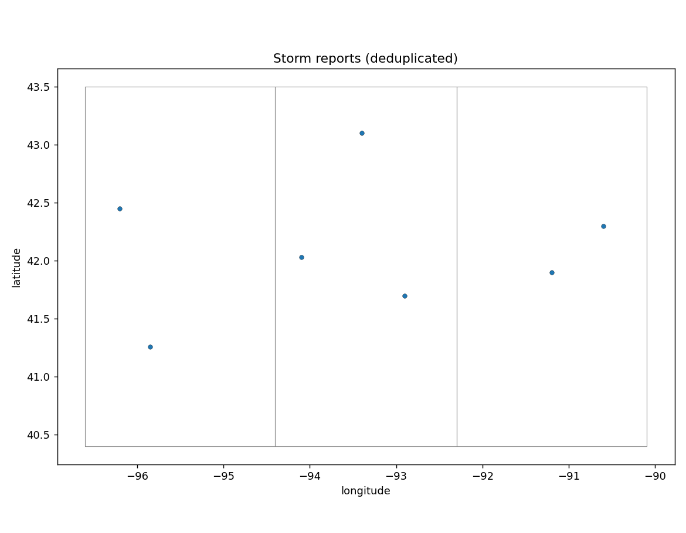

# 02 · Severe-weather report ETL & spatial reconciliation

Turn raw SPC/NWS-style storm reports into a clean, deduplicated, boundary-tagged
GIS layer — the reconciliation work behind an operational severe-weather product.

**Pipeline:** `acquire → validate → normalize → deduplicate → spatial join → publish`

```
storm reports (CSV)
    │  validate    (required fields, timestamps, coordinates)
    ▼
normalize   (HAIL/hail → hail; magnitude → numeric; UTC timestamps)
    │
    ▼
deduplicate (exact + probable: same event type within 3 km / 15 min;
    │        earliest kept, late/revised reports preserved)
    ▼
spatial join (point-in-polygon → county/state; unmatched reports KEPT)
    ▼
publish     GeoJSON + cleaned CSV + daily event map + processing.json
```

## Geospatial concepts

Schema validation · event-type & unit normalization · duplicate reconciliation
with a spatial+temporal gate · point geometry · **record-preserving** point-in-
polygon joins · CRS reconciliation before joining.

## Run

> **`--live`** fetches real SPC storm reports for a convective day:
> `python run_pipeline.py --live --date 2025-05-15`
> (omit `--date` for the latest available). See the repo
> [Live data](../../README.md#live-data) section.


```bash
python run_pipeline.py --aoi ../../sample-data/boundaries/iowa_counties_sample.geojson
```

## Outputs

`storm_reports_clean.csv` · `storm_reports.geojson` · `storm_reports_map.png` ·
`summary.json` (counts by event type, count outside AOI) · `processing.json`.



## Quality control demonstrated

The sample includes an exact duplicate (two identical hail reports one minute
apart), a **midnight-crossing** near-duplicate, and a report with an invalid
longitude (`-999`). The deduplicator removes the first two and the coordinate
check drops the third — each action is recorded in `processing.json`. Distinct
event types and reports far apart in space are never collapsed.

## Limitations

Boundaries are simplified rectangular stand-ins for offline use. For production,
supply authoritative county/CWA polygons via `--aoi`.
