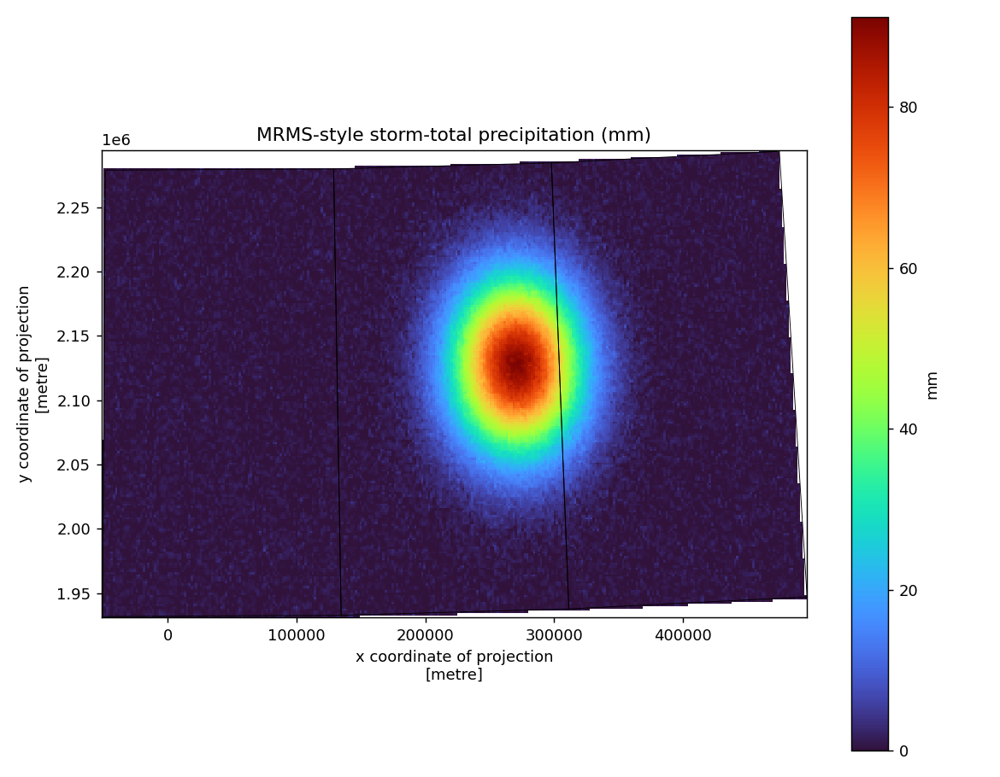

# 03 · MRMS radar raster analysis & zonal statistics

Process a gridded radar-derived precipitation field into a clean, reprojected
Cloud Optimized GeoTIFF and per-county statistics.

**Pipeline:** `acquire → inspect → clip → reproject → analyze → publish`

```
MRMS-style QPE grid
    │  inspect   (variable, CRS, transform, nodata, valid range)
    ▼
clip        (to area-of-interest polygons)
    │
    ▼
reproject   (to EPSG:5070 equal-area so area stats are valid)
    │
    ▼
zonal stats (per-county max / mean / exceedance-pixel count)
    ▼
publish     COG + statistics table + map + processing.json
```

## Geospatial concepts

Raster metadata & nodata handling · clipping/masking to vector geometries ·
reprojection with an explicit resampling method · raster-to-vector zonal
statistics · **equal-area CRS** for defensible area math · Cloud Optimized
GeoTIFF output · before/after metadata capture in provenance.

## Run

> **`--live`** fetches the latest MRMS radar QPE from NOAA's S3 bucket
> (gzipped GRIB2): `python run_pipeline.py --live`. See the repo
> [Live data](../../README.md#live-data) section.


```bash
# Offline: a small deterministic synthetic QPE grid stands in for MRMS
python run_pipeline.py --aoi ../../sample-data/boundaries/iowa_counties_sample.geojson

# Real data: pass a downloaded MRMS GRIB2 or a GeoTIFF
python run_pipeline.py --input path/to/mrms_qpe.tif
```

Requires the `raster` and `geo` extras (`pip install -e ".[geo,raster,viz]"`).

## Outputs

`mrms_precip_cog.tif` (COG) · `county_precip_statistics.csv` ·
`county_precip_map.png` · `summary.json` · `processing.json`
(records source, source vs. output CRS, resampling method, and software versions).



## Meaning & honesty

MRMS radar-only QPE is a **radar-derived estimate** of precipitation, not a gauge
measurement; MESH is a radar-derived hail-size *proxy*, not an observed hailstone.
The README and provenance label products by what they actually are — the same
scientific-validation discipline the workflow is meant to demonstrate.

## Limitations

The default grid is synthetic so the example is fully reproducible offline. Real
MRMS files are larger and use their own projection/nodata conventions, which the
`--input` path reads directly.
