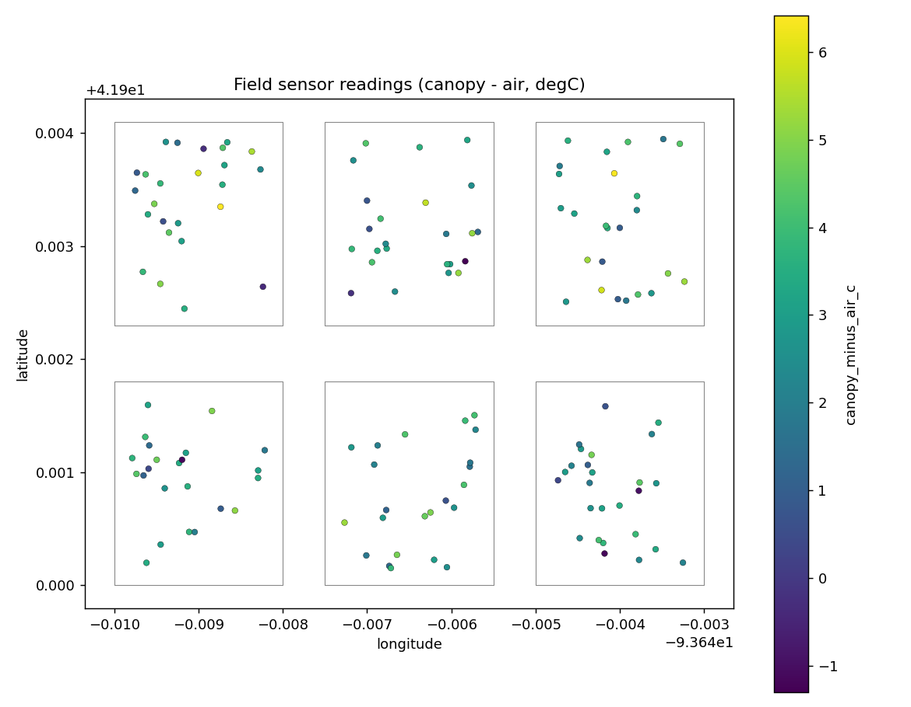

# 05 · GPS field-sensor processing (generic)

A generic, fully synthetic version of the field-sensing pattern: clean
GPS-tagged sensor readings, filter them to research plots with an **inward
buffer**, assign each reading to a plot by spatial join, and summarize per plot.

> Uses only synthetic data and generic column names — no proprietary trial
> layouts, sensor payloads, or measurements.

**Pipeline:** `acquire → validate → QC → boundary filter → spatial join → summarize`

```
GPS sensor readings
    │  QC        (drop invalid coords; flag implausible temperatures)
    ▼
inward buffer   (shrink each plot in an EQUAL-AREA CRS so edge points that may
    │            straddle a neighbouring plot are excluded)
    ▼
spatial join    (reading → plot_id)
    ▼
per-plot summaries (mean air / canopy / canopy−air) + map + processing.json
```

## Geospatial concepts

GPS coordinate validation · physical-range QC with flags (not silent drops) ·
**metric buffering in an equal-area CRS** (never buffer in degrees) · inward
buffer to remove edge contamination · point-in-polygon spatial join · grouped
plot-level aggregation.

## Run

> This workflow is **synthetic by design** — GPS field-sensor readings from a
> research trial have no public live source — so there is no `--live` flag. Real
> deployments supply their own sensor export via `--input`.


```bash
python run_pipeline.py --buffer-m 15
# larger buffer excludes more edge points:
python run_pipeline.py --buffer-m 40
```

Provide real data with `--input sensors.csv` (columns: `sensor_id, timestamp,
longitude, latitude, air_temp_c, canopy_temp_c`).

## Outputs

`sensor_readings_clean.csv` · `sensor_readings.geojson` · `plot_summaries.csv` ·
`field_sensors_map.png` · `summary.json` · `processing.json`.



## Why the inward buffer matters

A GPS fix has error of several metres. A reading logged just inside a plot edge
may physically belong to the neighbour. Shrinking each plot before the join
keeps only readings confidently within a single plot — the difference between a
clean plot mean and one contaminated by the adjacent treatment.

## Limitations

Readings and plots are synthetic. Real deployments need the sensor's actual GPS
accuracy spec to choose the buffer distance, and may require differential
correction before this step.
