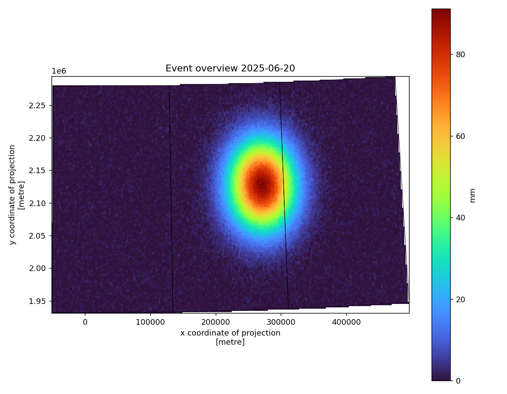

# 06 · Multi-source weather-event package (capstone)

Integrate every earlier workflow into **one** self-describing event package for a
given date / area of interest — the orchestration, provenance, and
partial-failure handling that turn a set of scripts into a product.

**Pipeline:** `acquire (many sources) → validate/normalize each → integrate → publish`

```
              ┌──────────────────── Orchestrator ────────────────────┐
boundaries ──▶│ required  ┐                                           │
storm reports▶│ required  ├─▶ integrate ─▶ event_package/            │
station obs ─▶│ optional  │   (each stage independent; an optional    │
MRMS raster ─▶│ optional  ┘    stage that fails degrades to a warning)│
              └───────────────────────────────────────────────────────┘
```

## What it demonstrates

Orchestration of independent stages · **partial-failure handling** (a missing
optional input logs a warning instead of aborting) · provenance across multiple
sources · deterministic output naming · packaging heterogeneous geospatial
products (vector + raster + tabular) together. Reuses `weather_geo.matching`,
`weather_geo.raster`, `weather_geo.vector`, and `weather_geo.pipeline`.

## Run

> **`--live`** assembles the package from live SPC reports, IEM ASOS obs, and
> MRMS radar: `python run_pipeline.py --live --date 2024-05-21`. Live MRMS is a
> rolling real-time archive, so for a past report date the radar layer reflects
> the latest available scan — a temporal caveat that `processing.json` records.
> See the repo [Live data](../../README.md#live-data) section.


```bash
python run_pipeline.py --date 2025-06-20 \
    --aoi ../../sample-data/boundaries/iowa_counties_sample.geojson

# Graceful degradation: drop an optional layer, package still builds:
python run_pipeline.py --observations /does/not/exist.csv
```

## Output package

```
event_package/
├── event_layers.gpkg              # storm_reports + boundaries layers
├── storm_reports.parquet          # deduplicated, county-tagged reports
├── match_evidence.parquet         # report ↔ nearest station evidence
├── county_precip_statistics.csv   # per-county zonal stats
├── raster/
│   └── event_precip.tif           # Cloud Optimized GeoTIFF
├── maps/
│   └── event_overview.png
└── metadata/
    ├── sources.json               # every input, URI, retrieval time
    ├── processing.json            # parameters, counts, software, stage summary
    └── warnings.json              # exactly which stages were skipped and why
```



## The important part

It is not the overview map — it is that the package is **honest about itself**.
`warnings.json` records every skipped stage with its error, `sources.json`
records provenance for every layer, and required vs. optional stages are
distinguished so a core failure aborts but a missing radar layer does not. That
is what makes an automated product trustworthy in operations.

## Limitations

Uses the bundled offline samples and a synthetic MRMS-style grid. Swapping in
real acquisition (SPC reports, mesonet APIs, MRMS GRIB2) is a matter of pointing
the `--reports`/`--observations`/`--input` flags at live sources.
