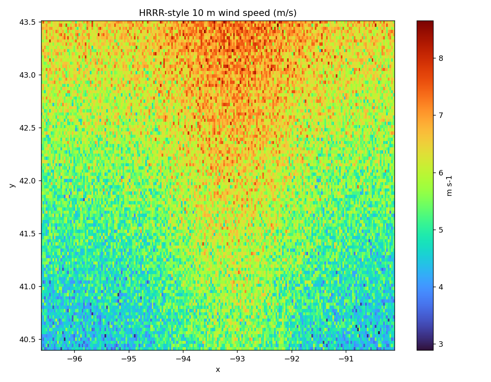

# 07 · HRRR model processing & model-vs-observation comparison

Process a gridded HRRR-style wind field, derive a scalar variable, sample it at
station locations, and compare against observations — numerical weather
prediction handled as geospatial model data.

**Pipeline:** `acquire → subset → derive → sample → compare → publish`

```
HRRR U/V wind field (small subset)
    │  subset      (bounding box)
    ▼
derive        (wind_speed = sqrt(u² + v²))
    │
    ▼
sample        (nearest grid cell at each station; off-grid → NaN)
    ▼
compare       (model − observation → bias, RMSE)
    ▼
publish       GeoTIFF + residual table + points + map + processing.json
```

## Geospatial concepts

Multidimensional xarray processing · model coordinates/CRS · derived
meteorological variables (wind speed from components) · grid subsetting ·
point sampling of a raster · model-vs-observation residuals with off-grid
handling.

## Run

> **`--live`** pulls the latest real HRRR cycle — using the `.idx` index to
> byte-range just the two 10 m-wind messages (~2 MB, not ~150 MB) — and compares
> it against live IEM ASOS obs at the model valid time:
> `python run_pipeline.py --live`. See the repo
> [Live data](../../README.md#live-data) section.


```bash
python run_pipeline.py
```

By default a small, deterministic synthetic HRRR-style field stands in for a
multi-gigabyte download. Real data (a NOMADS GRIB-filter subset opened with
xarray/cfgrib) drops into the same `derive → sample → compare` path.

## Outputs

`hrrr_wind_speed.tif` · `model_vs_obs.csv` (obs, model, residual per station) ·
`model_vs_obs.geojson` · `wind_speed_map.png` · `summary.json` (bias, RMSE) ·
`processing.json`.



## Honesty note

This is a geospatial **model-data processing** example, not proof that
point-scale HRRR winds are observations. Sampling the grid at a station returns
the *model's* value there; `summary.json` labels the bias/RMSE as a small demo,
not a formal verification study. Stations outside the model domain are reported
as off-grid rather than silently assigned an edge value.

## Limitations

Synthetic field and a tiny station sample; the statistics are illustrative.
Real verification needs matched valid times, quality-controlled obs, and a
representative station sample.
