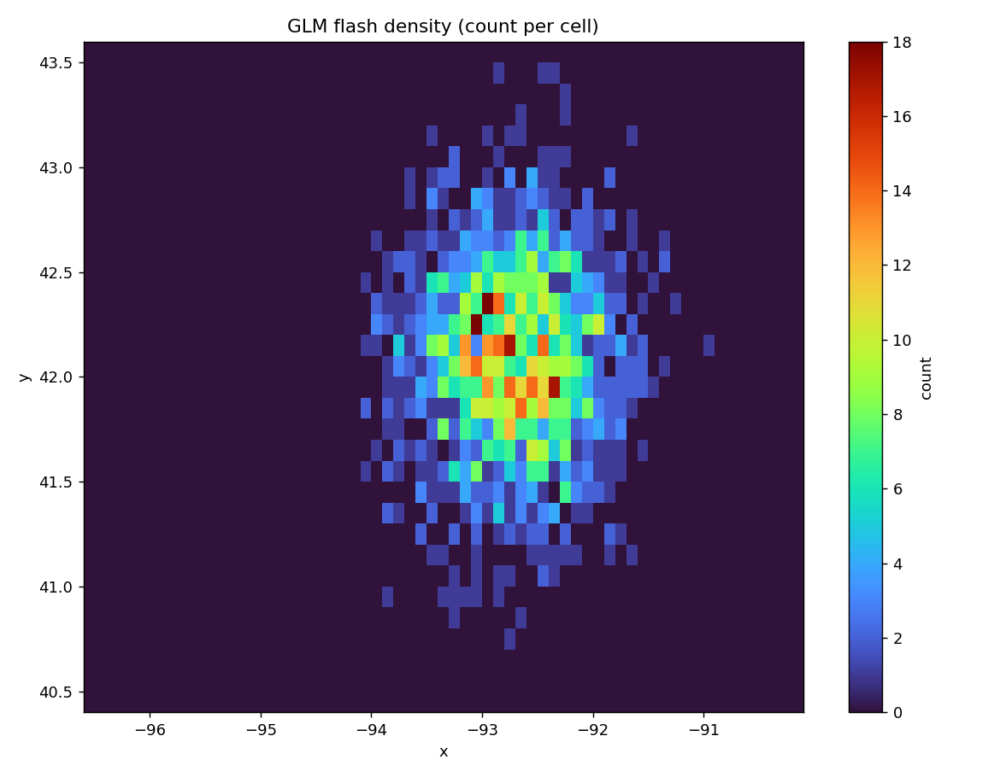

# 08 · GOES-GLM lightning spatial aggregation

Discover GOES-GLM lightning granules for a time window, read flash locations,
and aggregate them into a gridded flash-density product.

**Pipeline:** `discover → read → validate → aggregate → publish`

```
GLM granules (object storage)
    │  discover    (defensive: skip duplicate names & partial downloads)
    ▼
read          (flash lon/lat/energy per granule; track source_file)
    │
    ▼
validate      (drop invalid coordinates)
    ▼
aggregate     (bin flashes into a regular grid → count per cell)
    ▼
publish       density GeoTIFF + map + summary + processing.json
```

## Geospatial concepts

Object-storage discovery patterns · defensive download logic (partial/duplicate
detection) · point-to-grid binning (`np.histogram2d`, north-up orientation) ·
spatial density products · provenance of *which* source files contributed.

## Run

> **`--live`** discovers and reads real GOES-19 GLM granules from S3 for a recent
> window and aggregates over CONUS: `python run_pipeline.py --live --minutes 8`.
> See the repo [Live data](../../README.md#live-data) section.


```bash
python run_pipeline.py --cell-size 0.1
```

By default the granules are synthetic in-memory stand-ins for cloud objects, so
the example runs offline. Real granules (NOAA GOES on public cloud storage, read
with `xarray`/`netCDF4`) plug into the same `read → validate → aggregate` path.

## Outputs

`glm_flash_density.tif` · `flash_density_map.png` · `summary.json` (flashes used,
invalid dropped, contributing file count, grid diagnostics) · `processing.json`
(lists every contributing granule).



## The important part

Not the lightning map — the **defensive discovery**. The sample deliberately
includes a duplicate granule name and a truncated (partial) download; both are
detected and skipped, and `processing.json` records exactly which granules
actually contributed to the output. That is what keeps a time-partitioned
satellite product correct in production.

## Limitations

Synthetic flashes and a simple lon/lat grid. Real GLM data uses a fixed-grid
satellite projection and event/group/flash hierarchies; production aggregation
should also confirm continuous time coverage across the requested window.
