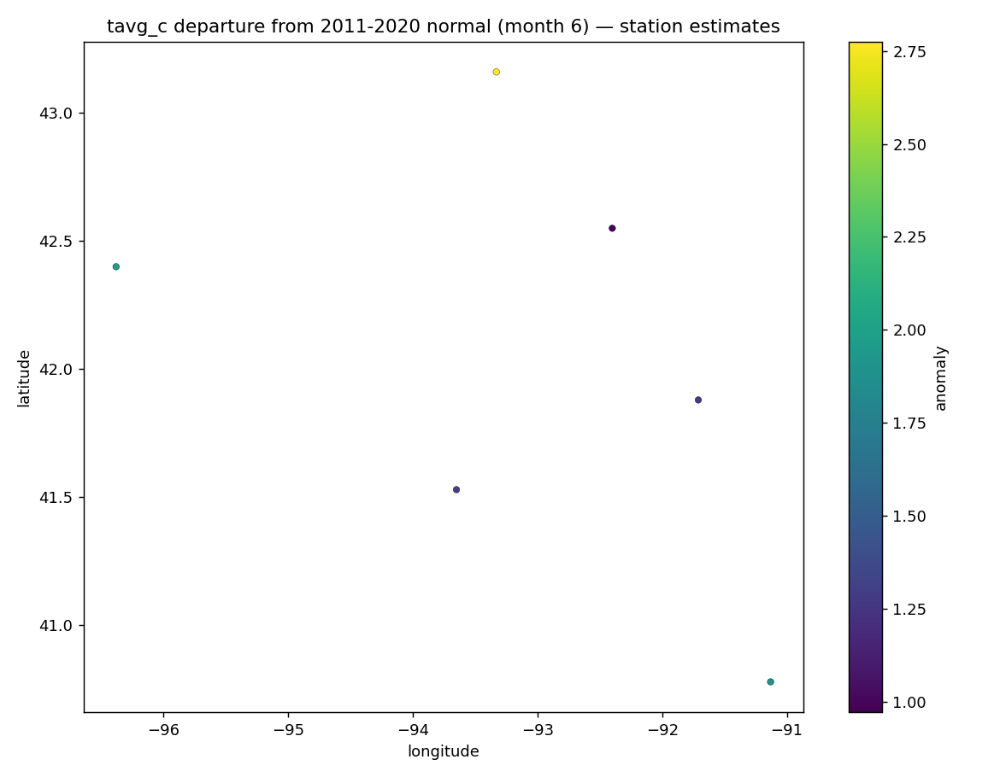

# 09 · Climate normals & anomaly mapping

Compute per-station climate **normals** over a baseline period and map a target
period's **departure from normal** — the climatology counterpart to the
operational workflows.

**Pipeline:** `acquire → validate → normals → anomaly → aggregate → publish`

```
GHCN-style monthly station values
    │  validate    (schema, coordinates, ranges)
    ▼
normals       (per-station mean over baseline years; count coverage)
    │
    ▼
anomaly       (target period mean − baseline normal; gaps kept as NaN)
    ▼
join stations ─▶ station anomaly table + GeoJSON + anomaly map + processing.json
```

## Geospatial concepts

Long-form multi-year time-series processing · **baseline-period** normals with
coverage counts · departure-from-normal calculation · explicit gap handling
(missing period/baseline → NaN, never silently dropped) · point anomaly mapping.

## Run

> **`--live`** fetches real NCEI GHCN-Daily records for Iowa stations:
> `python run_pipeline.py --live --baseline 1991 2020 --period 2021 2021 --month 6`.
> See the repo [Live data](../../README.md#live-data) section.


```bash
python run_pipeline.py --baseline 2011 2020 --period 2021 2021 --month 6
# temperature is the default; precipitation departures too:
python run_pipeline.py --value-col precip_mm
```

## Outputs

`station_anomalies.csv` (period, normal, anomaly, baseline-year count per
station) · `station_anomalies.geojson` · `anomaly_map.png` · `summary.json`
(mean/min/max anomaly) · `processing.json`.



## Honesty note

Station anomalies are **point** values. The map shows station estimates; any
continuous surface between stations would be an *estimate* from the available
network, not an observation everywhere. Normals built on fewer than five
baseline years are flagged in `processing.json` as less reliable rather than
being presented as equal-quality.

## Limitations

The bundled sample is synthetic and covers one month across a short baseline so
it stays small. Real use points `--input` at GHCN-Daily / NCEI data and would
typically use a 30-year (e.g. 1991–2020) baseline with station-completeness
screening before computing normals.
